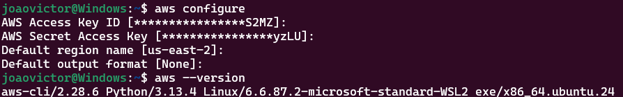
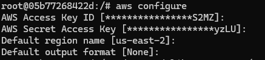
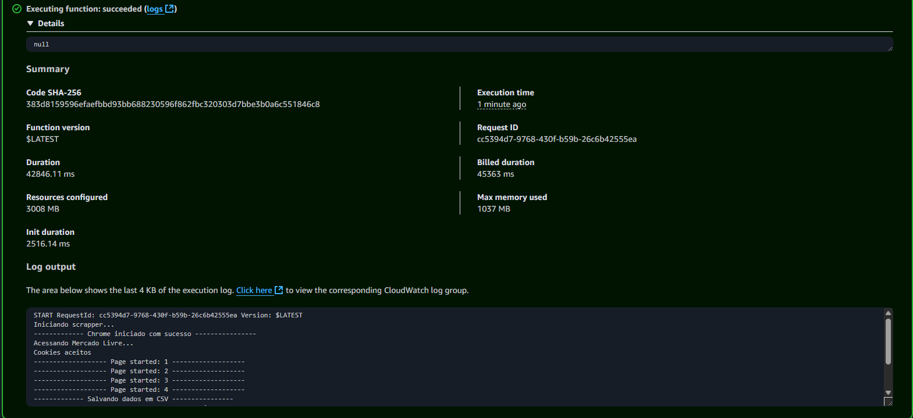
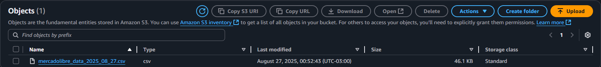

# MercadoLibre Scraper

A powerful web scraping solution for extracting product data from MercadoLibre (Mercado Livre) using Selenium and AWS Lambda. This project provides automated data extraction capabilities for e-commerce analysis and monitoring.

## 🚀 Features

- **Automated Web Scraping**: Uses Selenium WebDriver with Chrome in headless mode
- **AWS Lambda Integration**: Deployable as a serverless function
- **Data Export**: Exports scraped data to CSV format
- **S3 Integration**: Automatically uploads results to AWS S3
- **Docker Support**: Containerized deployment with Chrome dependencies
- **Terraform Infrastructure**: Infrastructure as Code for AWS resources

## 🏗️ Architecture

```
┌─────────────────┐    ┌─────────────────┐    ┌─────────────────┐
│   MercadoLibre │    │   AWS Lambda    │    │   S3 Bucket     │
│   Website      │◄──►│   Function      │───►│   (Data Store)  │
└─────────────────┘    └─────────────────┘    └─────────────────┘
                              │
                              ▼
                       ┌─────────────────┐
                       │   Chrome       │
                       │   Headless     │
                       └─────────────────┘
```

## 📋 Prerequisites

- Python 3.10+
- Docker
- AWS CLI configured
- Terraform (for infrastructure deployment)
- Chrome/Chromium browser

## 🛠️ Installation & Setup

### 1. Clone the Repository

```bash
git clone https://github.com/joaovictordesouzaduarte/mercadolibre_scrapper
cd mercadolibre_scrapper
```

### 2. Set Up Python Environment

```bash
# Create virtual environment
python -m venv venv

# Activate virtual environment
# On Linux/Mac:
source venv/bin/activate
# On Windows:
venv\Scripts\activate

# Install dependencies
pip install -r scripts/requirements.txt
```

### 3. AWS Configuration
- First, log in to the AWS Console and create a new ECR (Elastic Container Registry) repository named `mercadolibre-scrapper-repository`.

- Ensure that you have the AWS CLI installed on your local machine before proceeding.
#### How to Install AWS CLI

You need the AWS CLI to interact with AWS services. Follow the instructions below for your operating system:

<details>
<summary><strong>Windows</strong></summary>

1. **Download the AWS CLI MSI Installer:**

   [Download AWS CLI for Windows (64-bit)](https://awscli.amazonaws.com/AWSCLIV2.msi)

2. **Run the Installer:**

   Double-click the downloaded `.msi` file and follow the on-screen instructions.

3. **Verify Installation:**

   Open Command Prompt and run:
   ```cmd
   aws --version
   ```
   You should see the AWS CLI version output.
</details>

<details>
<summary><strong>macOS</strong></summary>

1. **Using Homebrew (recommended):**
   ```bash
   brew install awscli
   ```

2. **Or, use the bundled installer:**
   ```bash
   curl "https://awscli.amazonaws.com/AWSCLIV2.pkg" -o "AWSCLIV2.pkg"
   sudo installer -pkg AWSCLIV2.pkg -target /
   ```

3. **Verify Installation:**
   ```bash
   aws --version
   ```
</details>

<details>
<summary><strong>Linux</strong></summary>

1. **Download the AWS CLI installer:**
   ```bash
   curl "https://awscli.amazonaws.com/awscli-exe-linux-x86_64.zip" -o "awscliv2.zip"
   ```

2. **Unzip the installer:**
   ```bash
   unzip awscliv2.zip
   ```

3. **Run the install script:**
   ```bash
   sudo ./aws/install
   ```

4. **Verify Installation:**
   ```bash
   aws --version
   ```
</details>

- **How to get your AWS Secret Access Key:**  
  1. Sign in to the [AWS Management Console](https://console.aws.amazon.com/).  
  2. Click on your account name (top right) and select **Security Credentials**.  
  3. Under **Access keys**, click **Create access key**.  
  4. Download or copy your **Access key ID** and **Secret access key**.  
  > ⚠️ **Note:** You can only view your secret access key once when you create it. Store it securely.

- After that, you're able to interact with AWS services

- **How to configure AWS CLI on your local machine**

```bash
# Configure AWS credentials
aws configure
```
- Fill your credentails
- After that, execute the follow command

```bash
aws --version
```
- If you see something like the image bellow, you're ready


## 🏁 How to Start the Project

Follow these steps to get the project up and running:

1. **Set Up Environment Variables**

   Create a `.env` file in the root directory with your AWS_ACCESS_KEY_ID, AWS_SECRET_ACCESS_KEY, AWS_DEFAULT_REGION = us-east-2 end TERRAFORM_VERSION=1.6.6.

2. **Docker Usage**

   To run the project in a Docker container, follow the steps bellow:

    1. **Build the scrapper container:**
   ``` bash
   sudo docker build -t mercadolibre_scrapper:latest -f Dockerfile.lambda .
   ```
    2. **Tag the imagem**
   
   ```bash     
        sudo docker tag YOUR-CONTAINER-ID YOUR-AWS-ACCOUNT-ID.dkr.ecr.us-east-2.amazonaws.com/mercadolibre-scrapper-repository
    ```
    3. **Push the image to AWS ECR**
        1. **Authenticate your Docker client to the Amazon ECR registry to which you intend to push your image. Authentication tokens must be obtained for each registry used, and the tokens are valid for 12 hours.**

       ```bash     
            aws ecr get-login-password --region region | docker login --username AWS --password-stdin YOUR-AWS-ACCOUNT-ID.dkr.ecr.region.amazonaws.com
        ```
        2. **Push the image**
        ```bash     
            sudo docker push YOUR-AWS-ACCOUNT-ID.dkr.ecr.us-east-2.amazonaws.com/mercadolibre-scrapper-repository
        ```
    4. **Build the terraform image**
        ```bash     
            sudo docker build -f Dockerfile.terraform -t terraform_image .
        ```
    5. **Run the docker container based on terraform image**
        ```bash     
            sudo docker run --env-file ./.env -dit --name terraform_container terraform_image bin/bash
        ```
    6. Once the container is running, access it by executing the following command (replace YOUR-CONTAINER-ID with your actual container ID):

    ```bash
    sudo docker exec -it YOUR-CONTAINER-ID bin/bash
    ```

3. **AWS Lambda Deployment & Terraform usage**
   Inside the container that you've created above, follow these steps

      1. **Make share that you aws cli is configured correctly.
      ```bash
      aws configure      
      ```
      If you see somthing like the image bellow, the aws was configure correctly
      

      2. **Run the terraform**
      
```bash
   # Deploy infrastructure with Terraform
   cd mercadolibre_scrapper/terraform
   terraform init
   terraform plan
   terraform apply
```
4. **Test**
After deploying the project, you can go to the AWS Lambda console and test the deployed function. By checking the logs in AWS CloudWatch, you should see that everything was executed correctly, as the image bellow. Additionally, you can verify that the output file has been created in the specified S3 bucket.



In the S3, you can see a .csv file was saved. It's a sign that everything works!



**Contributing**
Feel free to open PRs for any improvements, bug fixes, or new features you think would benefit the project. I appreciate your contributions and will be happy to review and accept them!

**How to contribute:**
1. Fork this repository.
2. Create a new branch for your feature or fix.
3. Commit your changes with clear messages.
4. Open a Pull Request describing your changes and why they are needed.

Thank you for helping make this project better!

📧 Email: victorduarte.ufrj@gmail.com
[](https://www.linkedin.com/in/jvsduarte/)

